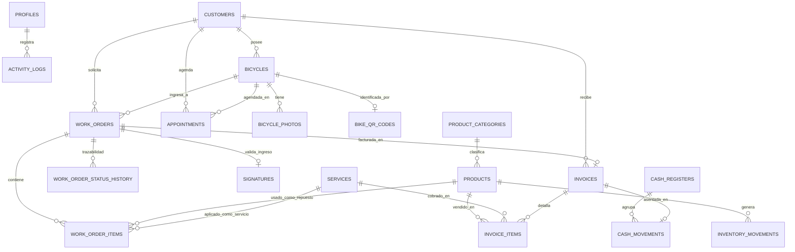

# Modelo y Diccionario de Base de Datos: A2Ruedas

Base de datos relacional sobre **PostgreSQL 15+** alojada en **Supabase** (`bmwrsekgpfculdtzvcfx.supabase.co`).
El modelo implementa **Row Level Security (RLS)** obligatorio en todas las entidades, garantizando la confidencialidad de la información del taller y habilitando únicamente la consulta pública y segura del catálogo de productos y fichas públicas de bicicletas por QR.

---

## 1. Diagrama Entidad-Relación (ER)

---

## 2. Diccionario de Tablas

### 2.1. `profiles` (Usuarios del Sistema)
Extiende `auth.users` de Supabase con información de perfil y rol administrativo.

| Columna | Tipo | Restricciones | Descripción |
| :--- | :--- | :--- | :--- |
| `id` | `UUID` | PK, REFERENCES `auth.users(id)` | Identificador del usuario |
| `full_name` | `TEXT` | NOT NULL | Nombre y apellidos del técnico/admin |
| `role` | `TEXT` | NOT NULL, CHECK in ('admin', 'mechanic') | Rol operativo |
| `phone` | `TEXT` | NULL | Teléfono de contacto |
| `is_active` | `BOOLEAN` | DEFAULT true | Estado de la cuenta |
| `created_at` | `TIMESTAMPTZ` | DEFAULT now() | Fecha de creación |
| `updated_at` | `TIMESTAMPTZ` | DEFAULT now() | Última actualización |

---

### 2.2. `customers` (Clientes del Taller)
Directorio central de clientes.

| Columna | Tipo | Restricciones | Descripción |
| :--- | :--- | :--- | :--- |
| `id` | `UUID` | PK, DEFAULT gen_random_uuid() | Identificador único |
| `full_name` | `TEXT` | NOT NULL | Nombre completo |
| `phone` | `TEXT` | NOT NULL | Teléfono principal |
| `whatsapp` | `TEXT` | NULL | Número para mensajes de WhatsApp |
| `email` | `TEXT` | NULL | Correo electrónico |
| `document_id` | `TEXT` | NULL | Cédula / Documento de identidad |
| `address` | `TEXT` | NULL | Dirección de residencia |
| `notes` | `TEXT` | NULL | Observaciones generales sobre el cliente |
| `created_at` | `TIMESTAMPTZ` | DEFAULT now() | Fecha de alta |
| `updated_at` | `TIMESTAMPTZ` | DEFAULT now() | Última modificación |

---

### 2.3. `bicycles` (Bicicletas de Clientes)
Registro de bicicletas con especificaciones técnicas.

| Columna | Tipo | Restricciones | Descripción |
| :--- | :--- | :--- | :--- |
| `id` | `UUID` | PK, DEFAULT gen_random_uuid() | Identificador interno |
| `customer_id` | `UUID` | NOT NULL, REFERENCES `customers(id)` | Propietario |
| `brand` | `TEXT` | NOT NULL | Marca (ej. Trek, Specialized, Giant) |
| `model` | `TEXT` | NOT NULL | Modelo de la bicicleta |
| `bike_type` | `TEXT` | NOT NULL | Tipo: Ruta, MTB, Urbana, Gravel, E-Bike |
| `color` | `TEXT` | NOT NULL | Color principal |
| `frame_size` | `TEXT` | NULL | Talla de marco (S, M, L, 52, 54, etc.) |
| `serial_number` | `TEXT` | NULL, UNIQUE | Número de serie del marco |
| `year` | `INT` | NULL | Año aproximado del modelo |
| `key_components` | `TEXT` | NULL | Transmisión, frenos, horquilla, ruedas |
| `observations` | `TEXT` | NULL | Detalles técnicos adicionales |
| `created_at` | `TIMESTAMPTZ` | DEFAULT now() | Fecha de registro |
| `updated_at` | `TIMESTAMPTZ` | DEFAULT now() | Última modificación |

---

### 2.4. `bicycle_photos` (Fotografías de Estado)
Imágenes capturadas durante la recepción e inspección técnica.

| Columna | Tipo | Restricciones | Descripción |
| :--- | :--- | :--- | :--- |
| `id` | `UUID` | PK, DEFAULT gen_random_uuid() | Identificador de foto |
| `bicycle_id` | `UUID` | NOT NULL, REFERENCES `bicycles(id)` | Bicicleta asociada |
| `work_order_id` | `UUID` | NULL, REFERENCES `work_orders(id)` | Orden asociada (si aplica) |
| `photo_url` | `TEXT` | NOT NULL | URL en Supabase Storage |
| `photo_type` | `TEXT` | NOT NULL | 'reception_damage', 'accessory', 'general' |
| `caption` | `TEXT` | NULL | Descripción del detalle capturado |
| `created_at` | `TIMESTAMPTZ` | DEFAULT now() | Fecha de captura |

---

### 2.5. `bike_qr_codes` (Identificadores QR de Bicicleta)
Códigos QR únicos generados para cada bicicleta.

| Columna | Tipo | Restricciones | Descripción |
| :--- | :--- | :--- | :--- |
| `id` | `UUID` | PK, DEFAULT gen_random_uuid() | Identificador |
| `bicycle_id` | `UUID` | NOT NULL, UNIQUE, REFERENCES `bicycles(id)` | Bicicleta vinculada |
| `qr_code` | `TEXT` | NOT NULL, UNIQUE | Código formateado (ej. `BIKE-8F3A92`) |
| `public_token` | `TEXT` | NOT NULL, UNIQUE | Token para ruta segura `/bike/:code` |
| `is_active` | `BOOLEAN` | DEFAULT true | Estado del código |
| `created_at` | `TIMESTAMPTZ` | DEFAULT now() | Fecha de emisión |

---

### 2.6. `product_categories` (Categorías de Productos)
Clasificación para inventario y catálogo público.

| Columna | Tipo | Restricciones | Descripción |
| :--- | :--- | :--- | :--- |
| `id` | `UUID` | PK, DEFAULT gen_random_uuid() | Identificador |
| `name` | `TEXT` | NOT NULL, UNIQUE | Nombre de categoría (ej. Transmisión) |
| `slug` | `TEXT` | NOT NULL, UNIQUE | Identificador para URL |
| `description` | `TEXT` | NULL | Breve descripción |
| `created_at` | `TIMESTAMPTZ` | DEFAULT now() | Fecha de creación |

---

### 2.7. `products` (Inventario y Venta de Productos)
Catálogo completo con control de stock, costos y precios.

| Columna | Tipo | Restricciones | Descripción |
| :--- | :--- | :--- | :--- |
| `id` | `UUID` | PK, DEFAULT gen_random_uuid() | Identificador |
| `sku` | `TEXT` | NOT NULL, UNIQUE | Código de referencia / SKU |
| `category_id` | `UUID` | NOT NULL, REFERENCES `product_categories(id)` | Categoría |
| `name` | `TEXT` | NOT NULL | Nombre comercial |
| `brand` | `TEXT` | NOT NULL | Marca del repuesto / accesorio |
| `description` | `TEXT` | NULL | Descripción detallada |
| `cost_price` | `NUMERIC(12,2)` | NOT NULL, CHECK (cost_price >= 0) | Costo de adquisición (privado) |
| `sale_price` | `NUMERIC(12,2)` | NOT NULL, CHECK (sale_price >= 0) | Precio de venta al público |
| `stock` | `INT` | NOT NULL, DEFAULT 0 | Existencias actuales |
| `min_stock` | `INT` | NOT NULL, DEFAULT 2 | Umbral para alerta de stock bajo |
| `unit` | `TEXT` | NOT NULL, DEFAULT 'unidad' | Unidad de medida (unidad, par, metro) |
| `location` | `TEXT` | NULL | Ubicación física en taller (Estante A-2) |
| `image_url` | `TEXT` | NULL | Fotografía del producto |
| `is_active` | `BOOLEAN` | DEFAULT true | Disponible para la venta |
| `created_at` | `TIMESTAMPTZ` | DEFAULT now() | Fecha de alta |
| `updated_at` | `TIMESTAMPTZ` | DEFAULT now() | Última modificación |

---

### 2.8. `inventory_movements` (Kardex de Inventario)
Auditoría y trazabilidad estricta de entradas y salidas.

| Columna | Tipo | Restricciones | Descripción |
| :--- | :--- | :--- | :--- |
| `id` | `UUID` | PK, DEFAULT gen_random_uuid() | Identificador |
| `product_id` | `UUID` | NOT NULL, REFERENCES `products(id)` | Producto afectado |
| `movement_type` | `TEXT` | NOT NULL, CHECK in ('in', 'out', 'adjustment') | Tipo de movimiento |
| `quantity` | `INT` | NOT NULL | Cantidad movida |
| `previous_stock` | `INT` | NOT NULL | Stock antes del movimiento |
| `new_stock` | `INT` | NOT NULL | Stock resultante |
| `reason` | `TEXT` | NOT NULL | Venta, orden de trabajo, compra, ajuste |
| `reference_id` | `UUID` | NULL | ID de OT o Factura si aplica |
| `user_id` | `UUID` | NULL, REFERENCES `profiles(id)` | Usuario que realizó el ajuste |
| `created_at` | `TIMESTAMPTZ` | DEFAULT now() | Fecha y hora del movimiento |

---

### 2.9. `services` (Catálogo de Servicios y Mano de Obra)
Tarifario estándar de mano de obra del taller.

| Columna | Tipo | Restricciones | Descripción |
| :--- | :--- | :--- | :--- |
| `id` | `UUID` | PK, DEFAULT gen_random_uuid() | Identificador |
| `name` | `TEXT` | NOT NULL | Nombre (ej. Mantenimiento General) |
| `description` | `TEXT` | NULL | Qué incluye el servicio |
| `estimated_minutes` | `INT` | NOT NULL, DEFAULT 60 | Tiempo estimado de ejecución |
| `price` | `NUMERIC(12,2)` | NOT NULL, CHECK (price >= 0) | Precio estándar |
| `is_active` | `BOOLEAN` | DEFAULT true | Activo en catálogo |
| `created_at` | `TIMESTAMPTZ` | DEFAULT now() | Fecha de creación |

---

### 2.10. `work_orders` (Órdenes de Trabajo)
Gestión central del taller con numeración correlativa (`OT-000001`).

| Columna | Tipo | Restricciones | Descripción |
| :--- | :--- | :--- | :--- |
| `id` | `UUID` | PK, DEFAULT gen_random_uuid() | Identificador interno |
| `order_number` | `TEXT` | NOT NULL, UNIQUE | Código legible (OT-000001) |
| `customer_id` | `UUID` | NOT NULL, REFERENCES `customers(id)` | Cliente |
| `bicycle_id` | `UUID` | NOT NULL, REFERENCES `bicycles(id)` | Bicicleta |
| `technician_id` | `UUID` | NULL, REFERENCES `profiles(id)` | Técnico asignado |
| `status` | `TEXT` | NOT NULL, DEFAULT 'RECIBIDA' | Estado actual de la orden |
| `reported_issues` | `TEXT` | NOT NULL | Problemas reportados por el cliente |
| `accessories_received` | `TEXT` | NULL | Accesorios entregados (luces, velocímetro) |
| `entry_mileage_km` | `NUMERIC` | NULL | Kilometraje si aplica (ej. E-Bikes) |
| `estimated_delivery_at` | `TIMESTAMPTZ` | NULL | Fecha prometida de entrega |
| `total_labor` | `NUMERIC(12,2)` | NOT NULL, DEFAULT 0 | Subtotal mano de obra |
| `total_parts` | `NUMERIC(12,2)` | NOT NULL, DEFAULT 0 | Subtotal repuestos |
| `discount` | `NUMERIC(12,2)` | NOT NULL, DEFAULT 0 | Descuento aplicado |
| `grand_total` | `NUMERIC(12,2)` | NOT NULL, DEFAULT 0 | Total a pagar |
| `internal_notes` | `TEXT` | NULL | Notas técnicas privadas |
| `created_at` | `TIMESTAMPTZ` | DEFAULT now() | Fecha y hora de recepción |
| `updated_at` | `TIMESTAMPTZ` | DEFAULT now() | Última modificación |

**Estados de Orden permitidos:**
- `RECIBIDA`
- `DIAGNOSTICO`
- `PRESUPUESTO`
- `APROBADA`
- `EN_REPARACION`
- `ESPERANDO_REPUESTO`
- `LISTA`
- `ENTREGADA`
- `CANCELADA`

---

### 2.11. `work_order_items` (Líneas de la Orden)
Repuestos y servicios incluidos en la orden de trabajo.

| Columna | Tipo | Restricciones | Descripción |
| :--- | :--- | :--- | :--- |
| `id` | `UUID` | PK, DEFAULT gen_random_uuid() | Identificador |
| `work_order_id` | `UUID` | NOT NULL, REFERENCES `work_orders(id)` ON DELETE CASCADE | Orden padre |
| `item_type` | `TEXT` | NOT NULL, CHECK in ('service', 'part') | Tipo de concepto |
| `product_id` | `UUID` | NULL, REFERENCES `products(id)` | Producto si es 'part' |
| `service_id` | `UUID` | NULL, REFERENCES `services(id)` | Servicio si es 'service' |
| `description` | `TEXT` | NOT NULL | Descripción del ítem |
| `quantity` | `INT` | NOT NULL, CHECK (quantity > 0) | Cantidad |
| `unit_price` | `NUMERIC(12,2)` | NOT NULL, CHECK (unit_price >= 0) | Precio unitario aplicado |
| `total_price` | `NUMERIC(12,2)` | NOT NULL, CHECK (total_price >= 0) | Total de la línea |
| `created_at` | `TIMESTAMPTZ` | DEFAULT now() | Fecha de adición |

---

### 2.12. `work_order_status_history` (Trazabilidad y Auditoría de Estados)
Registro inmutable de cada transición de estado de la orden.

| Columna | Tipo | Restricciones | Descripción |
| :--- | :--- | :--- | :--- |
| `id` | `UUID` | PK, DEFAULT gen_random_uuid() | Identificador |
| `work_order_id` | `UUID` | NOT NULL, REFERENCES `work_orders(id)` ON DELETE CASCADE | Orden |
| `from_status` | `TEXT` | NULL | Estado anterior |
| `to_status` | `TEXT` | NOT NULL | Nuevo estado |
| `user_id` | `UUID` | NULL, REFERENCES `profiles(id)` | Responsable del cambio |
| `notes` | `TEXT` | NULL | Comentario o justificativo |
| `created_at` | `TIMESTAMPTZ` | DEFAULT now() | Fecha y hora exacta |

---

### 2.13. `signatures` (Firma Digital Táctil de Recepción y Entrega)
Firmas digitales capturadas en pantalla táctil o mouse.

| Columna | Tipo | Restricciones | Descripción |
| :--- | :--- | :--- | :--- |
| `id` | `UUID` | PK, DEFAULT gen_random_uuid() | Identificador |
| `work_order_id` | `UUID` | NOT NULL, REFERENCES `work_orders(id)` | Orden de trabajo |
| `signature_type` | `TEXT` | NOT NULL, CHECK in ('reception', 'delivery') | Tipo de firma |
| `signature_data` | `TEXT` | NOT NULL | Trazo en formato Base64 PNG o SVG |
| `signer_name` | `TEXT` | NOT NULL | Nombre de quien firma |
| `signer_doc` | `TEXT` | NULL | Documento del firmante |
| `signed_at` | `TIMESTAMPTZ` | DEFAULT now() | Momento de la firma |

---

### 2.14. `cash_registers` (Sesiones de Caja)
Apertura y cierre diario de caja del taller.

| Columna | Tipo | Restricciones | Descripción |
| :--- | :--- | :--- | :--- |
| `id` | `UUID` | PK, DEFAULT gen_random_uuid() | Identificador de sesión |
| `opened_by` | `UUID` | NOT NULL, REFERENCES `profiles(id)` | Usuario que abre |
| `opened_at` | `TIMESTAMPTZ` | DEFAULT now() | Fecha y hora de apertura |
| `initial_amount` | `NUMERIC(12,2)` | NOT NULL, DEFAULT 0 | Base en efectivo de inicio |
| `closed_by` | `UUID` | NULL, REFERENCES `profiles(id)` | Usuario que cierra |
| `closed_at` | `TIMESTAMPTZ` | NULL | Fecha y hora de cierre |
| `final_counted_amount` | `NUMERIC(12,2)` | NULL | Efectivo contado en arqueo |
| `system_calculated_amount` | `NUMERIC(12,2)` | NULL | Efectivo esperado por sistema |
| `difference` | `NUMERIC(12,2)` | NULL | Sobrante (+) o faltante (-) |
| `status` | `TEXT` | NOT NULL, DEFAULT 'OPEN', CHECK in ('OPEN', 'CLOSED') | Estado de la caja |
| `notes` | `TEXT` | NULL | Observaciones del cierre |

---

### 2.15. `cash_movements` (Movimientos de Caja)
Ingresos y egresos detallados vinculados a la caja activa.

| Columna | Tipo | Restricciones | Descripción |
| :--- | :--- | :--- | :--- |
| `id` | `UUID` | PK, DEFAULT gen_random_uuid() | Identificador |
| `cash_register_id` | `UUID` | NOT NULL, REFERENCES `cash_registers(id)` | Caja activa |
| `type` | `TEXT` | NOT NULL, CHECK in ('INCOME', 'EXPENSE') | Ingreso o egreso |
| `concept` | `TEXT` | NOT NULL | Venta, servicio, anticipo, repuesto, gasto |
| `amount` | `NUMERIC(12,2)` | NOT NULL, CHECK (amount > 0) | Monto monetario |
| `payment_method` | `TEXT` | NOT NULL, CHECK in ('CASH', 'TRANSFER', 'CARD', 'OTHER') | Medio de pago |
| `reference_type` | `TEXT` | NULL | 'WORK_ORDER', 'INVOICE', 'MANUAL' |
| `reference_id` | `UUID` | NULL | ID de OT o Factura vinculada |
| `user_id` | `UUID` | NOT NULL, REFERENCES `profiles(id)` | Quien registró |
| `notes` | `TEXT` | NULL | Observación adicional |
| `created_at` | `TIMESTAMPTZ` | DEFAULT now() | Fecha y hora |

---

### 2.16. `invoices` (Facturación y Recibos Internos)
Documentos de cobro generados para clientes.

| Columna | Tipo | Restricciones | Descripción |
| :--- | :--- | :--- | :--- |
| `id` | `UUID` | PK, DEFAULT gen_random_uuid() | Identificador |
| `invoice_number` | `TEXT` | NOT NULL, UNIQUE | Código interno (ej. FAC-000123) |
| `customer_id` | `UUID` | NOT NULL, REFERENCES `customers(id)` | Cliente |
| `work_order_id` | `UUID` | NULL, REFERENCES `work_orders(id)` | OT vinculada (si aplica) |
| `subtotal` | `NUMERIC(12,2)` | NOT NULL, DEFAULT 0 | Subtotal sin descuentos |
| `discount` | `NUMERIC(12,2)` | NOT NULL, DEFAULT 0 | Descuentos |
| `tax` | `NUMERIC(12,2)` | NOT NULL, DEFAULT 0 | Impuestos si aplican |
| `total` | `NUMERIC(12,2)` | NOT NULL, DEFAULT 0 | Total final |
| `payment_method` | `TEXT` | NOT NULL | Efectivo, transferencia, tarjeta |
| `payment_status` | `TEXT` | NOT NULL, DEFAULT 'PAID' | PAID, PENDING, CANCELLED |
| `issued_by` | `UUID` | NOT NULL, REFERENCES `profiles(id)` | Usuario emisor |
| `created_at` | `TIMESTAMPTZ` | DEFAULT now() | Fecha de expedición |

---

### 2.17. `invoice_items` (Detalle de Factura)
Líneas de cobro de productos y servicios facturados.

| Columna | Tipo | Restricciones | Descripción |
| :--- | :--- | :--- | :--- |
| `id` | `UUID` | PK, DEFAULT gen_random_uuid() | Identificador |
| `invoice_id` | `UUID` | NOT NULL, REFERENCES `invoices(id)` ON DELETE CASCADE | Factura |
| `description` | `TEXT` | NOT NULL | Concepto facturado |
| `quantity` | `INT` | NOT NULL, CHECK (quantity > 0) | Cantidad |
| `unit_price` | `NUMERIC(12,2)` | NOT NULL | Precio unitario |
| `total_price` | `NUMERIC(12,2)` | NOT NULL | Total línea |

---

### 2.18. `appointments` (Agenda de Mantenimientos)
Citas programadas para ingreso o entrega de bicicletas.

| Columna | Tipo | Restricciones | Descripción |
| :--- | :--- | :--- | :--- |
| `id` | `UUID` | PK, DEFAULT gen_random_uuid() | Identificador |
| `customer_id` | `UUID` | NOT NULL, REFERENCES `customers(id)` | Cliente |
| `bicycle_id` | `UUID` | NULL, REFERENCES `bicycles(id)` | Bicicleta |
| `service_id` | `UUID` | NULL, REFERENCES `services(id)` | Servicio solicitado |
| `technician_id` | `UUID` | NULL, REFERENCES `profiles(id)` | Técnico asignado |
| `scheduled_at` | `TIMESTAMPTZ` | NOT NULL | Fecha y hora agendada |
| `estimated_duration_min` | `INT` | NOT NULL, DEFAULT 60 | Duración en minutos |
| `status` | `TEXT` | NOT NULL, DEFAULT 'SCHEDULED' | SCHEDULED, IN_PROGRESS, COMPLETED, CANCELLED |
| `notes` | `TEXT` | NULL | Observaciones de la cita |
| `created_at` | `TIMESTAMPTZ` | DEFAULT now() | Fecha de agendamiento |

---

### 2.19. `whatsapp_messages` (Historial de Mensajes de WhatsApp)
Trazabilidad de comunicaciones enviadas a clientes.

| Columna | Tipo | Restricciones | Descripción |
| :--- | :--- | :--- | :--- |
| `id` | `UUID` | PK, DEFAULT gen_random_uuid() | Identificador |
| `customer_id` | `UUID` | NOT NULL, REFERENCES `customers(id)` | Destinatario |
| `work_order_id` | `UUID` | NULL, REFERENCES `work_orders(id)` | OT vinculada |
| `phone_number` | `TEXT` | NOT NULL | Teléfono al que se envió |
| `message_content` | `TEXT` | NOT NULL | Contenido del texto generado |
| `status_trigger` | `TEXT` | NOT NULL | RECIBIDA, LISTA, PRESUPUESTO, etc. |
| `created_at` | `TIMESTAMPTZ` | DEFAULT now() | Momento de generación |

---

### 2.20. `activity_logs` (Registro de Auditoría de Operaciones)
Bitácora de seguridad con todas las acciones críticas ejecutadas.

| Columna | Tipo | Restricciones | Descripción |
| :--- | :--- | :--- | :--- |
| `id` | `UUID` | PK, DEFAULT gen_random_uuid() | Identificador |
| `user_id` | `UUID` | NULL, REFERENCES `profiles(id)` | Autor de la acción |
| `action` | `TEXT` | NOT NULL | CREATE, UPDATE, DELETE, CANCEL, CLOSE_CASH |
| `entity` | `TEXT` | NOT NULL | Tabla o módulo afectado |
| `entity_id` | `TEXT` | NOT NULL | ID del registro modificado |
| `details` | `JSONB` | NULL | Snapshot o diferencias del cambio |
| `created_at` | `TIMESTAMPTZ` | DEFAULT now() | Momento exacto |

---

## 3. Políticas de Seguridad (Row Level Security - RLS)

Todas las tablas tendrán `ALTER TABLE [table_name] ENABLE ROW LEVEL SECURITY;`.

1. **Lectura Pública (Anónima)**:
   - `products`: Permitida únicamente donde `is_active = true`. Los campos `cost_price` no son accesibles para el rol público mediante vistas o filtros de API.
   - `product_categories`: Permitida solo lectura.
   - `bicycles` & `work_orders` (Historial QR): Lectura filtrada por `public_token` mediante una función RPC de base de datos segura (`get_bike_public_timeline(public_token)`), impidiendo que consultas directas lean datos de otros clientes o información privada.
2. **Acceso Administrativo**:
   - Acceso total para usuarios con token JWT válido de Supabase (`auth.role() = 'authenticated'`).
   - Verificación de pertenencia activa en la tabla `profiles`.
